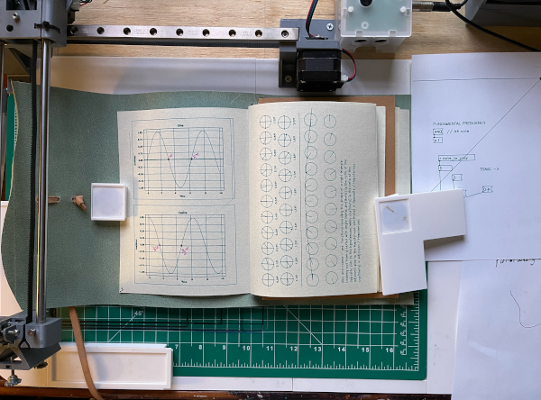

# Plot Notes
Plot Notes is a project that explores the practice of note taking with a pen plotter. A pen plotter is a drawing machine that can potentially use any writing/drawing tool such as a pen which is lowered and raised within the machine's x and y axis to draw. 

There are many versions of pen plotters. I am using an arduino powered one running a modified version of GRBL to control a small servo for the pen. My drawing area is 22.5cm x 25cm.

## Why a Pen Plotter?
Using a pen plotter instead of an inkjet printer for example, has the advantage of being more analogue. With my pen plotter, I have the freedom of experimenting with any type of paper or flat material to draw on, any type of pen, marker, paint, or any other experimental media. This makes the range of possible materials I can use very flexible to include cheap and recyclable options.

It is also great because it provides a fun way of transfering my computer generated art to the real world. It combines the digital with the physical through experimentation of code and material.

## The Goal
The goal is to condense the things I have learned into an easily digestible plot. All of these notes will be plotted and collected in physical book form. My copy uses a page with the dimensions of 14cm x 19cm. 

I am using a combination of matplotlib, processing, and pure data for the visualizations. I am also using Hershey Text v3.0 from the AxiDraw extension for Inkscape. The font is HersheySans1.

It is no accident that these notes will also include actual plots, graphs, tables, and other forms of data visualization. My focuses include topics relating to math, music theory, sound synthesis, and computer science. I intend to use my own code for the visuals which will be included in this repo.

